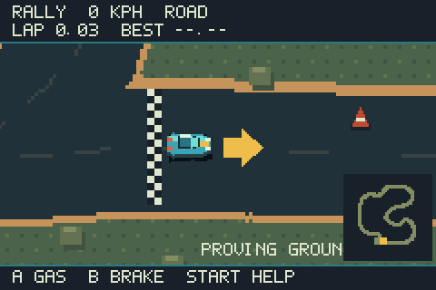

# Dustline

[](https://github.com/abhuva/dirtline/actions/workflows/release.yml)
[](https://github.com/abhuva/dirtline/releases/latest/download/dustline.gba)
[](https://creativecommons.org/licenses/by-sa/4.0/)

An original driving and combat RPG prototype built for the Game Boy Advance.
Dustline combines momentum-heavy arcade handling, controlled slides, procedural
wastelands, roaming enemy drivers, and outposts with garages and vehicle setups.



## Play the latest build

Download **[dustline.gba](https://github.com/abhuva/dirtline/releases/latest/download/dustline.gba)**
from the latest release and open it with [mGBA](https://mgba.io/) or RetroArch's
Nintendo - Game Boy Advance (mGBA) core. This is a complete homebrew ROM; no base
game, patch, or GBA BIOS is required.

The current build is an in-development prototype. It has no cartridge saves,
quests, inventory, shop economy, or persistent progression yet.

## Controls

| Button | Driving | Menus and towns |
| --- | --- | --- |
| A | Accelerate | Confirm, interact, enter doors |
| B | Brake, then reverse | Cancel |
| Left / Right | Steer | Choose map, setup, or setting |
| L | Cycle weapon | — |
| R | Use selected weapon | — |
| Select | Open settings | Return from pause to map selection |
| Start | Pause | Resume |
| D-pad | Left/right steer; up/down unused | Walk in towns |

Try releasing the throttle before a bend, turning through it, and applying power
again on exit. The car retains momentum while coasting, and its heading can differ
from its direction of travel.

## What's in the prototype

- A native GBA ROM written in C++ with Butano and devkitARM.
- Eight fixed-seed 8192 x 8192 procedural maps selected from the title screen.
- Fixed elevated 2D presentation with momentum, grip-limited sliding, braking,
  reverse, terrain collisions, and three distinct vehicle setups.
- Streaming terrain, a zoomable minimap, outposts, walkable towns, and a garage.
- Pooled enemy drivers and five weapons: gun, saw, side guns, homing missiles,
  and traps.
- Player health, a rechargeable shield, synthesized audio, and original pixel art.
- A local browser-based procedural map workshop shared with the ROM generator.

For the complete gameplay notes, current limitations, architecture, map-workshop
guide, and verification details, see [readme.txt](readme.txt).

## Build locally

On Windows, install Git and Docker Desktop using Linux containers, then run:

```powershell
powershell -NoProfile -ExecutionPolicy Bypass -File .\build.ps1
```

The script fetches Butano 21.8.0 at its pinned commit, builds the pinned devkitARM
container, generates all derived assets, and writes the playable ROM to
`dist/dustline.gba`. Generated graphics, audio, and headers should not be edited
by hand; their source is `tools/generate_assets.py` and the other generators in
`tools/`.

To run the emulator-driven verification suite after building:

```powershell
powershell -NoProfile -ExecutionPolicy Bypass -File .\test.ps1
```

The automated checks use headless mGBA and normal GBA joypad input. They verify
generation, driving, collisions, scenes, settings, combat, spawning, and frame
budgets; they are not a substitute for subjective controller playtesting.

## Continuous delivery

Every push to `main` runs the reproducible container build in GitHub Actions and
replaces the rolling **[Latest playable build](https://github.com/abhuva/dirtline/releases/latest)**.
The release contains the raw ROM, its SHA-256 checksum, and a ZIP with the ROM,
play notes, and third-party notices.

## Project direction

The immediate priority is satisfying driving: readable grip, throttle release,
controlled slides, and meaningful vehicle setups. RPG progression will grow on
top of that foundation after more playtesting. The game takes inspiration from
the feel of classic GBA vehicle adventures, but uses original code, art, audio,
names, physics, and world design.

## Credits and licensing

Dustline uses [Butano](https://github.com/GValiente/butano) and devkitARM. The
full upstream notice set ships in `dist/licenses/` and in each packaged release.

Except for separately identified third-party material, Dustline's game-specific
code, artwork, audio, documentation, and compiled ROM are licensed under the
[Creative Commons Attribution-ShareAlike 4.0 International License](LICENSE).
Credit **Dustline by Marc Bielert**, link to this repository and the license, and
indicate whether you made changes. Third-party components remain under their
respective licenses.
