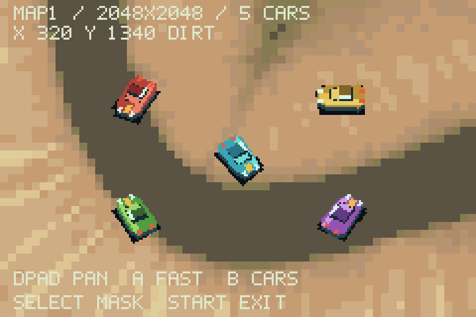

# Map1: first GBA graphics experiment

Archived experiment: the current ROM uses playable map2. The map1 panning mode
and its menu entry have been removed; the instructions and measurements below
describe the historical ROM identified by its hash.

The full 2048 x 2048 world fits with five independently loaded, animated car
sprites. The selected conversion uses coarse 4 x 4 terrain pixels and 15 opaque
colors. This demonstrates feasibility; fine erosion detail and smooth color
gradients are visibly lost.

## Try it

Open `dist/dustline.gba` with mGBA and press **Select on the title screen**.
D-pad pans; hold A for faster movement; B toggles the five car references;
Select toggles the road/dirt surface grid. Start returns to the title.
This is a graphics viewer, with no car physics or
AI running. The original driving prototype remains accessible with A at the title.

## Input and conversion

- Source: `maps/map1/background.png`, actually 2049 x 2049 pixels.
- Source SHA-256: `53497dc16e06664cf640f30a5791a314ee1d80d596801a4823412d235f04e79e`.
- Source preserved byte-for-byte.
- Normalize to 2048 x 2048; BOX-average to 512 x 512; median-cut to 15 colors
  without dithering; reduce palette precision to GBA RGB5; expand to 2048 x 2048
  with nearest-neighbor sampling. The world and car scale stay unchanged.
- `maps/map1/mask.png` is aligned with the background. Values below 128 are dirt;
  values at least 128 are road. Sampling each 8 x 8 cell center gives 3,989 road
  cells and 61,547 dirt cells. The grid is verified in the emulator and can be
  toggled with Select. No collision terrain has been defined.
- Mask SHA-256: `37c51c7a412488d26c6df1e97b12b418d9b45f79c3764622f728e4159da5bd98`.

## Measured comparison

Counts below are distinct 8 x 8 patterns after horizontal/vertical flip reuse,
before the compiler adds its transparent tile. All variants cover the same world.

| Opaque colors | Terrain pixel size | Unique patterns | Fits 1024-pattern ceiling |
|---|---:|---:|---|
| 15 | 1 x 1 | 53,606 | No |
| 15 | 2 x 2 | 36,922 | No |
| 15 | 4 x 4 | 911 | Yes |
| 15 | 8 x 8 | 15 | Yes, very coarse |
| 63 | 2 x 2 | 56,178 | No |
| 63 | 4 x 4 | 8,801 | No |

[Conversion contact sheet](comparison.png) / [Selected overview](selected-overview.png)

The color comparison was generated before the mask arrived; its historical
`mask_present` field is false. The final [selected report](selected-report.json)
and ROM test results include the mask.

## Compiled and resident budgets

| Resource | Measured usage | Meaning |
|---|---:|---|
| Compiled terrain patterns | 912 / 1024 | Includes transparent tile; 112 pattern slots remain |
| Compiled terrain tile data | 29,184 bytes | Raw tile graphics |
| Allocated background tile VRAM | 30 KiB | Includes Butano allocation rounding |
| Resident scrolling map | 2 KiB | Only the scrolling canvas occupies VRAM |
| Total background VRAM | 32 / 64 KiB | Does not imply another 1024 slots in this background |
| Full tilemap in ROM | 128 KiB | 256 x 256 two-byte map entries |
| Complete terrain graphics in ROM | 160,288 bytes | Tiles + full map + palette, uncompressed |
| Five independent current car frames | 2,560 bytes | Five 32 x 32 4bpp frames; one loaded direction each |
| Cars and text sprite tiles | 4,992 bytes | Measured with labels visible |
| Free sprite tile VRAM | 27,776 bytes | About 27.1 KiB out of the separate 32 KiB sprite pool |
| Sprite palette entries | 80 / 256 | Five 16-entry car palettes; font shares the original palette |
| Static IWRAM | 11,532 bytes | Whole executable's static allocation |
| Sampled IWRAM stack | 1,276 bytes | Snapshot, not a measured stack high-water mark |
| Static EWRAM | 33,584 bytes | Whole executable's static allocation |
| Heap used / available | 0 / 228,560 bytes | During this preview |
| Surface lookup data in ROM | 64 KiB | One byte per 8 x 8 cell, not copied to RAM |
| Surface visualization in ROM | 131,200 bytes | Separate diagnostic map, loaded on demand |
| Whole ROM | 759,552 bytes | Original prototype plus graphics experiment and mask |

Five car sheets contain the same geometry in different paint colors, each in a
separate graphics array with its own palette. All 64 directions are exercised;
only each car's current frame is resident. These are not five distinct vehicle
designs or five simulated opponents.

## Verification

`build.ps1` and `test.ps1` passed. The original controller-driven driving lap and
handling checks still pass. Map tests verify all four camera limits, rendered
pixels against the converted image, independent car allocations, repeated scene
unload/reload, and return to the driving prototype.

The five-car panning test peaked at **61.87% reported CPU use**, with **zero missed
frames**. Cars change direction every third frame and labels refresh every sixth
frame, including simultaneous updates. This measures the graphics viewer, not a
future race with AI, collisions, particles and audio. Human visual judgment and
physical GBA testing remain outstanding.

ROM SHA-256: `8019f69602793a2bf436ecf651f76fc559a872756ab399a1c610678f02bee411`.

[Machine-readable measurements and checks](test-results.json) /
[Conversion measurements](conversion-report.json) / [Panning capture](pan.gif)
